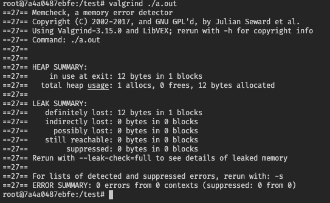

# Mem leak test environment
<p>Creates a Ubuntu enviroment with Gcc Valgrind installed to test leaks in your projects</p>
<br />

## Dependences
- Docker

## Getting started

### 1. open Makefile and update the path

### 2. open the terminal and run:
```
make build
make run
```
<p>the first command will create a ubuntu 20:4 container with valgrind</p>
<p>the second command will start the container and map the volume of the path thay you defined and start bash</p>

<br />

## Testing leaks into your programs
## 1. Enter in test folder
```
	cd test
```
## 2. generate a compiled file
```
gcc <filename>.c -g -o main 
```

## 3. run valgrind
```
valgrind --leak-check=full ./main
```

## example
### code
```c
#include <stdlib.h>

int main(void)
{
	int *x = malloc(3 * sizeof(int));
	x[0] = 1;
	x[1] = 1;
	x[2] = 1;

	// free(x);

	return (0);
}
```
### output
<p></p>

